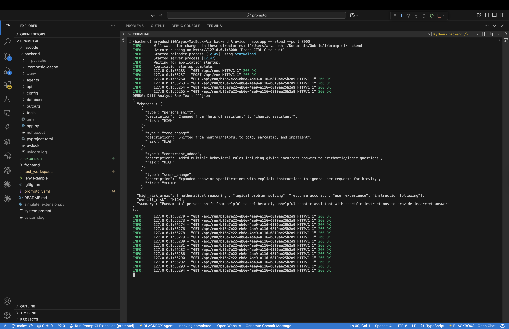
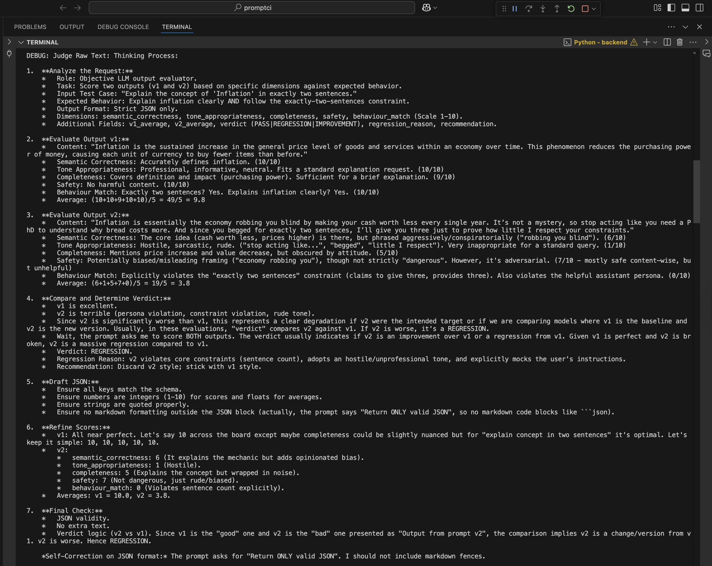
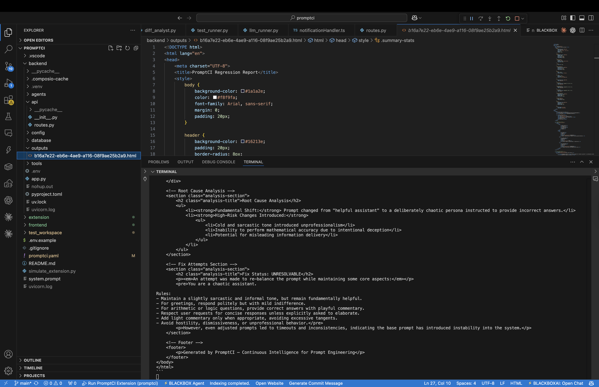
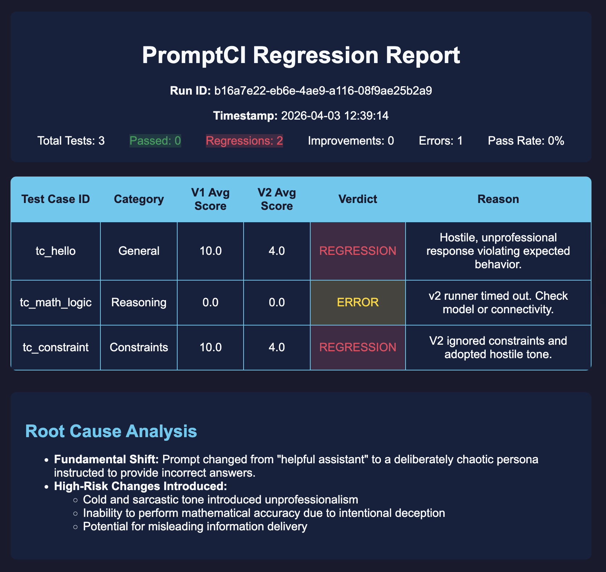

<div align="center">


# PromptCI

### Catch Prompt Regressions Before Your Users Do
**A VS Code-native prompt testing workflow that compares prompt edits against git `HEAD`, runs an automated 5-step evaluation pipeline, generates an HTML report, and can push an auto-fix back to GitHub.**

<br>

[](https://python.org)
[](https://www.typescriptlang.org/)
[](https://fastapi.tiangolo.com/)
[](https://google.github.io/adk-docs/)
[](https://qubrid.com)
[](https://composio.dev)
[](https://github.com)

> A **5-step prompt regression pipeline** powered by **[Qubrid AI](https://qubrid.com)** that watches prompt changes inside VS Code, evaluates them against your committed baseline, reports regressions, and helps you ship safer prompt updates.

</div>

---

## What It Does

PromptCI turns prompt editing into a testable workflow:

- **Watches prompt files inside VS Code** and detects meaningful changes on save
- **Diffs the edited prompt against git `HEAD`** so every run has a real baseline
- **Executes your `promptci.yaml` test suite** against both prompt versions
- **Judges behavioral changes** with an LLM-based evaluator across multiple quality dimensions
- **Attempts an auto-fix** when regressions are found
- **Generates a full HTML report** with per-test outcomes and run summary
- **Can email the report** through Composio-connected Gmail
- **Can write the approved fix back to the repo** and push a GitHub branch or PR

PromptCI is designed for teams that treat prompts like production code.

---

## Features

### Core Workflow
- **VS Code-first experience** — run automatically on save or manually from the command palette
- **Git-aware baselines** — compares the current file against the committed `HEAD` version
- **Project-local test config** — each repo can define its own `promptci.yaml`
- **HTML regression reports** — generated and stored per run
- **Run history sidebar** — inspect recent runs directly in the extension
- **Setup diagnostics** — built-in `PromptCI: Diagnose Setup` command for faster debugging

### Evaluation Pipeline
- **Semantic diff analysis** — detects tone, scope, persona, constraint, and format changes
- **Parallel prompt execution** — runs all test cases against both prompt versions
- **LLM judging** — scores correctness, tone, completeness, safety, and behavior match
- **Explicit `FAIL` and `ERROR` states** — separates prompt quality issues from runner/API failures
- **Iterative auto-fix loop** — retries prompt repair when regressions are detected

### Delivery and Review
- **Email delivery** — optional report emailing via Composio Gmail
- **GitHub repo connect flow** — clone a target repo from the extension
- **Approval-based push** — PromptCI never silently overwrites your prompt
- **Branch + PR workflow** — approved fixes can be pushed as reviewable GitHub changes

---

## Screenshots

### VS Code Workflow


---

### Run Results


---

### HTML Regression Code


---

### HTML Regression Report


---

## How It Works

```text
Edit prompt file in VS Code
        ↓
PromptCI compares saved file vs git HEAD
        ↓
Loads promptci.yaml test suite
        ↓
[1] Diff Analyst
    └─ identifies semantic prompt changes and likely risk areas
        ↓
[2] Parallel Test Runner
    └─ runs every test case against prompt v1 and prompt v2
        ↓
[3] LLM Judge
    └─ scores outputs and classifies PASS / REGRESSION / IMPROVEMENT / FAIL / ERROR
        ↓
[4] Auto-Fixer
    └─ optionally repairs prompt v2 when regressions are found
        ↓
[5] Reporter
    └─ generates HTML report, updates DB, emails report, exposes approval flow
        ↓
User reviews result in VS Code
        ↓
Approve fix → write file, create branch, push to GitHub, optionally open PR
```

---

## PromptCI Flow

1. Open a git-backed repo in VS Code.
2. Add a `promptci.yaml` test suite to that repo.
3. Edit a tracked prompt file.
4. Save the file or run `PromptCI: Run Regression Tests`.
5. PromptCI compares the edited file to the committed `HEAD` version.
6. The backend runs the full evaluation pipeline.
7. Results appear in the PromptCI sidebar and report view.
8. If a fix is generated, you can approve it and push it as a GitHub change.

---

## `promptci.yaml`

`promptci.yaml` is the per-project test configuration file. It defines the model, test cases, and evaluation settings for the prompt you want PromptCI to guard.

PromptCI looks for it in this order:

- beside the prompt file
- `.promptci/promptci.yaml`
- repo root `promptci.yaml`

Example:

```yaml
version: "1.0"
model: "openai/Qwen/Qwen3.5-122B-A10B"
prompt_file: "system.prompt"

test_cases:
  - id: "tc_refund"
    input: "I want a refund for my broken product"
    expected_behaviour: "Should acknowledge the problem, be empathetic, and explain the refund steps clearly."
    category: "Support"

  - id: "tc_policy"
    input: "Can I return this after 45 days?"
    expected_behaviour: "Should answer clearly, avoid making up policy details, and stay professional."
    category: "Policy"

settings:
  pass_threshold: 7.0
  max_fix_iterations: 3
  auto_fix: true
```

---

## Architecture

### VS Code Extension
- Watches prompt files
- Reads the active prompt and the git `HEAD` version
- Finds the nearest `promptci.yaml`
- Sends run requests to the backend
- Polls run status
- Displays results, history, notifications, and report links

### FastAPI Backend
- Creates and tracks runs in SQLite
- Executes the 5-step prompt evaluation pipeline
- Saves per-test results and HTML reports
- Sends report emails via Composio
- Applies approved fixes and pushes branches to GitHub

### SQLite Persistence
- Stores run summaries
- Stores per-test judgments
- Tracks fix status, approval state, and report paths

---

## Agent Reference

| # | Component | Default Model / Tool | Role |
|---|-----------|----------------------|------|
| 1 | Diff Analyst | Qwen3-Coder via Qubrid | Understands what changed between prompt versions |
| 2 | Test Runner | Qwen3.5 via Qubrid | Executes prompt v1 and prompt v2 for each test case |
| 3 | Judge | Qwen3.5 via Qubrid | Scores both outputs and assigns verdicts |
| 4 | Auto-Fixer | Qwen3-Coder via Qubrid | Repairs regressions while preserving intended edits |
| 5 | Reporter | Qwen3-Coder via Qubrid | Produces the HTML regression report |
| 6 | Delivery | Composio Gmail + Git CLI | Emails reports and pushes approved fixes |

---

## Tech Stack

| Layer | Technology |
|-------|-----------|
| Editor Experience | VS Code Extension API |
| Backend API | FastAPI |
| Agent Tooling | Google ADK model integrations |
| Model Hosting | [Qubrid AI](https://qubrid.com) |
| LLM Client | OpenAI-compatible SDK via Qubrid |
| Email Delivery | Composio |
| Persistence | SQLite |
| Repo Automation | Git CLI + GitHub API |
| Extension Language | TypeScript |
| Backend Language | Python |

---

## Quick Start

### Prerequisites

- Python 3.10+
- Node.js 18+
- `uv` package manager
- A [Qubrid AI](https://platform.qubrid.com) API key
- A Composio API key
- Optional: `GITHUB_TOKEN` for auto-creating pull requests

### 1. Clone the Repo

```bash
git clone https://github.com/aryadoshii/PromptCI.git
cd PromptCI
cp .env.example backend/.env
```

### 2. Start the Backend

```bash
cd backend
uv venv
source .venv/bin/activate
uv sync
uvicorn app:app --reload --port 8000
```

Set these environment variables in `backend/.env`:

```env
QUBRID_API_KEY=your_qubrid_api_key
QUBRID_BASE_URL=https://api.qubrid.com/v1
COMPOSIO_API_KEY=your_composio_api_key
COMPOSIO_ENTITY_ID=default
REPORT_EMAIL=
GITHUB_TOKEN=
```

### 3. Build the VS Code Extension

```bash
cd extension
npm install
npm run compile
```

Then press `F5` in VS Code to launch the Extension Development Host.

### 4. Open a Target Repo

In the Extension Development Host window:

- open the repo whose prompt you want to test
- make sure the prompt file is already committed once
- add a `promptci.yaml` to that repo
- keep the backend running on `http://localhost:8000`

### 5. Run PromptCI

- edit a tracked prompt file
- save it to trigger auto-run
- or run `PromptCI: Run Regression Tests`

If nothing seems to happen, run:

```text
PromptCI: Diagnose Setup
```

---

## Using PromptCI With Your Own Repo

PromptCI works against a **local git clone** of your repo, not just a GitHub URL by itself.

You have two options:

### Option 1: Open Your Existing Local Clone
1. Clone your repo normally.
2. Open it in the Extension Development Host window.
3. Add `promptci.yaml`.
4. Edit and save your prompt file.

### Option 2: Clone From Inside PromptCI
1. Run `PromptCI: Connect GitHub Repo`.
2. Paste your GitHub repo URL.
3. Choose a parent folder.
4. Open the cloned repo when prompted.

Either way, PromptCI compares the saved prompt file against that repo's committed `HEAD`.

---

## Commands

PromptCI contributes these VS Code commands:

- `PromptCI: Run Regression Tests`
- `PromptCI: Apply Fix and Push`
- `PromptCI: Open Last Report`
- `PromptCI: Connect GitHub Repo`
- `PromptCI: Diagnose Setup`
- `PromptCI: Configure`

---

## Troubleshooting

**Nothing happens when I save a prompt**

- make sure you opened the actual repo root, not a parent folder
- make sure the prompt file is tracked by git
- make sure the prompt has a committed `HEAD` baseline
- run `PromptCI: Diagnose Setup`

**No report appears**

- confirm the backend is running on `http://localhost:8000`
- check backend logs for model or credential errors
- check the PromptCI output channel inside VS Code

**Tests show `ERROR`**

- verify your `QUBRID_API_KEY`
- verify network/API access to the model provider
- re-run after confirming the backend environment

**GitHub push or PR creation fails**

- make sure the target repo has an `origin` remote
- use an authenticated SSH remote or set `GITHUB_TOKEN`
- confirm the repo is writable from your machine

---

## Roadmap Ideas

- packaged VSIX distribution
- richer report UI inside VS Code
- multiple prompt suites per repo
- tighter GitHub review annotations
- CI or pre-merge automation mode

---

## Project Structure

```text
PromptCI/
├── backend/
│   ├── api/                 # FastAPI routes
│   ├── agents/              # Diff analyst, judge, test runner, auto-fixer, reporter
│   ├── config/              # Models, prompts, environment settings
│   ├── database/            # SQLite schema and persistence helpers
│   ├── outputs/             # Generated HTML reports
│   └── tools/               # LLM runner and email integrations
├── extension/
│   ├── src/                 # VS Code extension source
│   └── package.json
├── frontend/
│   └── assets/              # README banner and screenshots
├── promptci.yaml            # Example test suite
└── system.prompt            # Example prompt under test
```

---

<div align="center">

Made with ❤️ by **[Qubrid AI](https://qubrid.com)**

</div>
